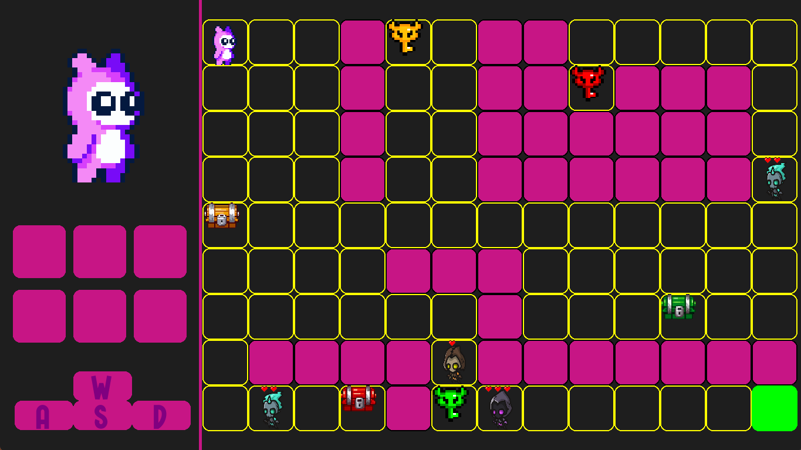

# 🧩 Laberinto

A retro-style maze adventure game built with Python and Pygame.

Explore dangerous labyrinths, avoid enemies, collect important objects, and reach the exit to complete each level.

---

## 🎮 Features

- Multiple maze levels
- Enemy AI and obstacles
- Inventory system
- Death counter
- Level progression saving
- Retro-inspired gameplay
- Simple and responsive controls

---

## 📸 Gameplay

Explore the maze, survive enemy encounters, and find the exit to advance through the game.

Example:



---

## 🛠 Requirements

To run the source code, you need:

- Python 3.10 or higher
- Pygame

Install Pygame using pip:

```bash
pip install pygame
```

---

If you're using Python 3.14

```bash
pip install pygame-ce
```

---


## ▶️ Running the Game

### Run the executable version

Open the `bin` folder and launch:

```text
Laberinto.exe
```

### Run from source code

Clone the repository:

```bash
git clone https://github.com/Slcmx54/Laberinto.git
```

Enter the project folder:

```bash
cd Laberinto
```

Run the game:

```bash
python main.py
```

---

## 🎯 Controls

| Key | Action |
|------|--------|
| W / A / S / D | Move |
| ESC | Pause / Back |
| ENTER | Confirm |
| Mouse | Menu navigation |

---

## 📂 Project Structure

```text
Laberinto/
│
├── bin/
│   └── Laberinto.exe
├── configuration/
├── font/
├── lang/
├── media/
│
├── lvl/
├── main.py
├── jugar.py
├── config.py
├── reiniciar.py
└── README.md
```

---

## 💾 Save System

The game automatically stores:

- Completed levels
- Player statistics
- Configuration settings

Progress is saved using JSON files.

---

## 🚀 Planned Features

- More levels
- Better enemy behaviors
- Sound effects and music
- Boss fights
- Improved graphics
- Multiplayer support

---

## 📜 License

This project is licensed under the MIT License.

---

## 👤 Author

Developed by **Salomé Cáliz Márquez**

GitHub: https://github.com/Slcmx54

---

## ⭐ Support

If you like this project, consider giving it a star on GitHub.
